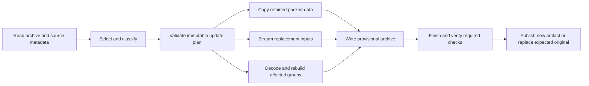

# 7-Zip option compatibility and archive editing plan

Written: 2026-10-09. Repository baseline: archive-rs 0.2.1, commit
`cb2394c1bc5faf518a28b6edaa739c11e816cb2d`.
Reference implementation: **7-Zip 26.04**, official source commit
[`9128b80e3a471108678e2b3ec3c985861c8d7b0f`](https://github.com/ip7z/7zip/tree/9128b80e3a471108678e2b3ec3c985861c8d7b0f).
This document defines future work. It does not imply that the options or update
operations described below are implemented or released.

The implemented subset and validation evidence are recorded separately in
[archive-options-implementation.md](archive-options-implementation.md).
The full completion gates below remain authoritative.

## Objective and boundaries

Support the applicable 7-Zip commands, switches, format properties, defaults,
and update decisions for formats archive-rs already exposes. Add entry addition,
replacement, removal, renaming, and supported metadata editing through portable
core APIs, a transactional native CLI, and browser APIs that produce a new
archive artifact. Editing means modifying archive contents and properties;
launching an external editor or building an editor UI is separate work.

Track option acceptance and actual behavior separately. A switch that parses
but has no effect is not an implemented compression feature. Record upstream
accepted no-ops explicitly. Unknown properties and unimplemented effective
properties must fail before opening output, rather than be silently ignored.

This is a compatibility target for the current format set, not a promise to add
every format 7-Zip can read. Preserve CAB, Brotli, standalone LZMA, zlib, raw
DEFLATE, and raw Windows codec functionality as archive-rs extensions where
upstream lacks the corresponding container writer. ISO, UDF, MSI, and package
inspection remain read-only until a separately specified writer exists. WIM is
a real parity gap: upstream writes it, so this plan includes a distinct WIM
authoring/update milestone rather than treating its current read-only status as
complete parity. Existing package APIs must not claim package validity after a
generic container edit.

Use published crates.io dependencies. Backend changes in ms-compress,
ms-cabinet, wim-rs, or ms-package require their own validation and publication
before activating new APIs here. Preserve old APIs where possible; use typed
builders/new APIs instead of casually adding mandatory fields to public structs.
Coordinate any breaking API/CLI change with a version bump. Do not change the
legacy package-core dependency bridge as a side effect of this work.

## 1. Pin and inventory the compatibility contract

Create a checked-in, machine-readable option inventory and a conformance harness.
For each command/format/property combination, record spelling and aliases, value
grammar, units, range, default resolution, effect, platform/build availability,
source reference, implementation status, and its acceptance tests. Proposed
statuses: implemented, accepted-no-effect, planned, extension, and unavailable.
Generate help and detailed capability output from the same inventory.

Capture the reference executable version, build configuration, hash, and fixture
provenance. Trace handler parsing through shared property parsing and encoder
registrations; then probe the executable. An older manual or a recognized method
name alone cannot establish support in the pinned build. In particular, current
ZIP source handles XZ and ZstdWz as well as older method families; verify actual
encoder availability before publishing an exhaustive method list.

Inventory both container properties and shared command behavior:

| Area | Required inventory |
| --- | --- |
| Commands | a/add, u/update, d/delete, rn/rename, l/list, t/test, x/extract with paths, e/extract without paths; compare/hash commands as applicable |
| Compression | -t format selection, -m property grammar, -mx levels, method names and numeric IDs, dictionary units, lc/lp/pb, fast bytes, match finder/cycles, threads and memory usage |
| Selection | -i/-x include/exclude, recursion modes, wildcard disabling, case policy, listfiles, listfile encodings/BOMs, -- termination, and stored-path policy |
| Metadata | Modification/access/creation times, timestamp precision, filename encodings, attributes, links, ownership, alternate streams and security metadata where the format/platform supports them |
| Operation | -p password/prompt behavior, output directory, overwrite modes, stdin/stdout, working directory, progress/log routing and verbosity, exit codes |
| Extended authoring | Solid grouping, filters/coder graphs, header compression/encryption, archive comments, volumes, SFX and multi-output -u action sets where applicable |

Volumes and SFX are separate backend milestones, not switches to accept before
they work. Platform-specific metadata needs explicit capability gates and native
tests. Differences imposed by the caller's filesystem policy must be reported
as compatibility differences, not hidden behind a full-parity claim.

Use these primary source entry points:

- [Command-line grammar](https://github.com/ip7z/7zip/blob/9128b80e3a471108678e2b3ec3c985861c8d7b0f/CPP/7zip/UI/Common/ArchiveCommandLine.cpp).
- [Shared method properties](https://github.com/ip7z/7zip/blob/9128b80e3a471108678e2b3ec3c985861c8d7b0f/CPP/7zip/Common/MethodProps.cpp).
- [Common output properties/defaults](https://github.com/ip7z/7zip/blob/9128b80e3a471108678e2b3ec3c985861c8d7b0f/CPP/7zip/Archive/Common/HandlerOut.cpp).
- [Listfile handling](https://github.com/ip7z/7zip/blob/9128b80e3a471108678e2b3ec3c985861c8d7b0f/CPP/Common/ListFileUtils.cpp).

### Per-format starting matrix

| Format | Current archive-rs behavior | Planned compatibility work |
| --- | --- | --- |
| ZIP | Copy/DEFLATE; always ZIP64; AES-256 or ZipCrypto; fixed codec tuning | Automatic classic ZIP/ZIP64, upstream method/property inventory, AES-128/192/256 selection, encoding/time/comment controls; then missing codecs and update execution |
| 7z | Copy/DEFLATE/LZMA/LZMA2/BZip2/Brotli choices; fixed tuning; independent entry writer | Upstream method/filter inventory, codec properties, multi-file solid grouping, header controls, metadata, and group-aware updates; classify non-upstream methods as extensions |
| TAR | USTAR/PAX writer and bounded reader | Explicit pax/posix/gnu profiles, encoding/time policies, extension preservation, sequential update reconstruction |
| gzip / TAR.gz | Fixed DEFLATE configuration and gzip header behavior | Applicable DEFLATE properties and header/time policy; distinguish one gzip payload from a multi-entry TAR wrapper |
| BZip2 / TAR.bz2 | Fixed level 9 | Level and applicable single-method controls; rebuild stream or wrapped TAR |
| XZ / TAR.xz | Fixed LZMA2 preset 6 and CRC64 | Codec properties, supported filters, check choices, block sizing/grouping, and wrapped TAR reconstruction |
| Standalone LZMA | Writer exists here; upstream container handler is read-only | Preserve extension writer; expose applicable LZMA tuning without claiming upstream container-writing parity |
| CAB | Copy/MSZIP/LZX/Quantum streaming writer; upstream CAB handler is read-only | Keep extension option contract; implement bounded rebuild updates and supported metadata preservation |
| Brotli / TAR.br | Fixed quality 5/window 22 | Extension quality/window controls and wrapped TAR reconstruction; do not invent stock 7-Zip container options |
| zlib / raw DEFLATE | Single-stream writers | Applicable DEFLATE tuning; one-payload replacement, not fictitious multi-entry editing |
| Raw Windows codecs | Single-file codec selectors and size/window settings | Keep explicit extension semantics; no archive command parity claim |
| WIM/ESD | Selected-image reading; no writer | Inventory upstream WIM authoring/update profile and implement that subset through the WIM backend; do not imply general ESD authoring |
| ISO / UDF | Read-only archive adapters | Applicable listing/testing/extraction options; reject editing until an authoring contract is separately implemented |
| MSI / APPX / MSIX / bundles | Read-only package facades | Applicable selection/read operations; no MSI database editor, package signer, or package writer implied |

Relevant handlers: [7z](https://github.com/ip7z/7zip/blob/9128b80e3a471108678e2b3ec3c985861c8d7b0f/CPP/7zip/Archive/7z/7zHandlerOut.cpp),
[ZIP](https://github.com/ip7z/7zip/blob/9128b80e3a471108678e2b3ec3c985861c8d7b0f/CPP/7zip/Archive/Zip/ZipHandlerOut.cpp),
[TAR](https://github.com/ip7z/7zip/blob/9128b80e3a471108678e2b3ec3c985861c8d7b0f/CPP/7zip/Archive/Tar/TarHandler.cpp).

### Defaults and ZIP compatibility

Resolve defaults from the pinned reference, including input-size and memory
adjustments. Upstream's common level defaults to 5; our current LZMA/LZMA2 preset
6 and BZip2 level 9 are not equivalent merely because their numbers look similar.
Compare resolved codec settings and behavior, not byte-identical compressed data.
Keep portable memory budgets caller-controlled and native automatic memory/thread
selection aligned with the established 7-Zip policy.

Implement automatic ZIP sizing without requiring a forcing flag. In the pinned
writer, ZIP64 fields are selected for sizes/offsets at least 0xFFFFFFFF; archive
end records also consider central-directory size/offset and counts at least
65,535. Pre-compression selection reserves ZIP64 from 0xF8000000 (3.875 GiB) to
allow expansion, except unencrypted Stored entries use their exact size. The
public ZIP option parser exposes no ZIP32/ZIP64 forcing switch.
[Sizing rules](https://github.com/ip7z/7zip/blob/9128b80e3a471108678e2b3ec3c985861c8d7b0f/CPP/7zip/Archive/Zip/ZipOut.cpp),
[pre-compression selection](https://github.com/ip7z/7zip/blob/9128b80e3a471108678e2b3ec3c985861c8d7b0f/CPP/7zip/Archive/Zip/ZipAddCommon.cpp).

Choose local headers before streaming payloads, then patch seekable headers or
write correctly sized descriptors. Select central ZIP64 fields individually,
including offset-only ZIP64. Upgrade preflight detection accordingly. Exercise
counts, decoded/compressed sizes, central offsets, and directory sizes at their
sentinel boundaries. Update existing tests that assume every small output is
ZIP64; retain explicit ZIP64 fixtures and modern-reader coverage.

## 2. Shared typed options and command frontend

Introduce typed format option builders and a shared validator/resolver. Keep
limits, encoding effort, archive metadata, and filesystem publication policy
distinct. Validate method combinations, ranges, feature availability, and
estimated workspace before creating output. Expose requested and effective
settings, including upstream accepted-no-effect properties, in detailed JSON.
Codec parameters must reach the backend and have measurable/testable effects.

Implement a dedicated compatibility frontend, initially `arc 7z ...`, with an
optional thin `arc7z` entry point after its grammar is stable. Both frontends
lower into the same typed operations. Existing native `arc create` remains
create-only and no-clobber. Its current `a` alias must not silently acquire
destructive update semantics during this change.

This namespace is necessary: native -t means extraction threads, -m supplies MSI
media, and -p names a password file, whereas upstream uses those spellings for
format, method, and password options. In the compatibility frontend, a/u/d/rn
and their switches have upstream meanings. Add native add/update/delete/rename
commands with explicit long options. Any later migration of native short aliases
requires a deliberate compatibility/version decision.

Preserve native encryption defaults; the compatibility frontend must resolve
upstream password/encryption defaults from its inventory rather than inherit
AES-256 accidentally. Support password prompts and explicitly supplied upstream
password syntax without echoing passwords in diagnostics, JSON, plans, or logs.
Keep native password-file input available. Build no security metadata or random
salts/IVs from deterministic test seeds in production.

Share one selection engine across list/test/extract/update. It must distinguish
archive names, stored encodings, filesystem source paths, and validated extraction
destinations. Archive renaming is not filesystem extraction, and a valid archive
name is not permission to write outside an extraction root. Specify non-UTF-8
names, case policy, directory descendants, duplicate names, literal wildcards,
listfile quoting/encodings, and names beginning with '-' or '@'.

## 3. Update decisions and immutable edit plans

Separate selection and classification from execution. Proposed core concepts:
UpdateState, UpdateActionSet, EditOperation, PlannedEntry, MetadataPolicy,
ArchiveFingerprint, UpdatePlan, and UpdateReport. Names are provisional API
design, not existing types. Include entry IDs, original/result names, payload
source, affected decoder/folder groups, preservation requirements, expected
sizes, codec availability, and memory/scratch estimates.

Match upstream's seven states and default actions:

| State | Condition after selection | a | u | d |
| --- | --- | ---: | ---: | ---: |
| p | Archive item outside selection | 1 | 1 | 1 |
| q | Selected archive item absent on disk | 1 | 1 | 0 |
| r | Disk item absent from archive | 2 | 2 | 0 |
| x | Archive item newer | 2 | 1 | 0 |
| y | Disk item newer | 2 | 2 | 0 |
| z | Equal comparison time and size | 2 | 1 | 0 |
| w | Equal/unknown time with differing/unknown size | 2 | 2 | 0 |

Actions: 0 omits an item, 1 retains archive data/properties, 2 uses disk
data/properties, and 3 creates an anti-item. Anti-items are deletion markers,
not ordinary removal. Also model the upstream freshen and synchronize action
sets; excluded p items survive synchronization.
[Action definitions](https://github.com/ip7z/7zip/blob/9128b80e3a471108678e2b3ec3c985861c8d7b0f/CPP/7zip/UI/Common/UpdateAction.cpp).

Implement the -u grammar and defaults precisely: reject p2/q2/r1; each -u action
set starts from command defaults, not the previously supplied set. Repeated
unsuffixed sets replace the previous set. -u- disables replacement of the base
archive; !name defines an additional output. Validate action 3 against actual
backend anti-item support. Rename accepts old/new pairs, with directory changes
matching path boundaries rather than arbitrary substring replacement.
[Parser](https://github.com/ip7z/7zip/blob/9128b80e3a471108678e2b3ec3c985861c8d7b0f/CPP/7zip/UI/Common/ArchiveCommandLine.cpp),
[rename execution](https://github.com/ip7z/7zip/blob/9128b80e3a471108678e2b3ec3c985861c8d7b0f/CPP/7zip/UI/Common/Update.cpp).

Carry stored timestamp precision and timezone representation through planning.
Compare DOS wall time, Unix seconds, and fractional FILETIME according to the
reference behavior; handle missing timestamps and representable ranges. Equal
time/size is an update-policy decision, not proof of content equality. An optional
content-hash comparison would be a separately documented extension.
[Comparison logic](https://github.com/ip7z/7zip/blob/9128b80e3a471108678e2b3ec3c985861c8d7b0f/CPP/7zip/UI/Common/UpdatePair.cpp).

Validate rename collisions/cycles, duplicate source/archive names, file-directory
conflicts, output/source overlap, unsupported preservation, and resource estimates
before execution. Produce a JSON dry-run with decisions and reasons. Never decode
old entries into a Vec of complete payloads merely to feed the creation API.

## 4. Bounded execution and native replacement

Core execution accepts readers, writers, cancellation/observation hooks, and a
caller-owned scratch provider. Add pull-based backend entry/group readers or a
bounded streaming bridge: current push extraction cannot simply be substituted
for the reader callback in create_from_readers. Limit codec memory, queued data,
open handles, metadata, scratch bytes, and temporary output separately. Reuse
one operation-level worker budget. Charge decoded bytes even when discarded.

Native archive-fs owns an UpdateTransaction: hold the original source handle,
write an adjacent provisional archive, finish it, check required integrity,
sync it, confirm the expected source/target identity, and use platform-specific
replacement. New-output publication remains no-clobber. Preserve originals on
cancellation, short/changing input, disk-full, codec/password failure, verification
failure, and detected concurrent replacement. Avoid append-in-place editing in
the initial implementation.

Specify cooperative locking, hardlinks, symlinks/reparse points, directory
handles, input/output aliasing, backup policy, and Windows sharing/replace rules.
A pathname check followed by rename is not a universal compare-and-swap guarantee;
document the remaining concurrent-writer assumptions and test conflicts. Multiple
-u outputs are separate publication transactions; report partial success rather
than pretending several renames are atomic together.

Reports distinguish structural validation, verification of changed entries,
and retained payloads copied without decoding. Raw copying an encrypted payload
does not establish authentication or recover a lost password. Offer explicit
verification policies without making every cheap rename secretly decompress the
entire archive. Browser execution returns a new artifact or writes through an
explicit storage adapter; it cannot promise native atomic filesystem replacement.

## 5. Format-specific editing

### ZIP first

Add validated packed-entry sources and a lossless representation of local/central
metadata. Preserve unchanged compressed/encrypted payloads without recompression;
rewrite headers, offsets, descriptors, and directory records. Stream new inputs.
Preserve comments, attributes, encoding information, supported extras, and their
ordering where meaningful. Classify unknown extras as safe to retain, dependent
on changed fields, or unsupported; do not discard them silently.

Rename may reuse packed bytes only when all affected metadata can be rebuilt
correctly. Timestamp changes in ZipCrypto descriptor-mode entries can affect its
password check byte; handle them with a valid rewrite/re-encryption path or fail.
Newly encrypted/re-encrypted entries require credentials and fresh randomness.
Preserve encryption and codec settings by default; changing passwords or methods
is an explicit transcode operation. Gate split archives, SFX prefixes, trailing
data, duplicate-name archives, and unsupported methods until lossless behavior
exists. ZIP64 remains available automatically for every applicable field.

### TAR and compressed TAR

Preserve raw records/extensions for untouched entries; rebuild changed headers
and stream payloads with correct padding/end markers. Model PAX local/global
scope and GNU long names before claiming lossless rename/metadata edits. Plain
TAR can use sequential reconstruction; compressed TAR decodes and re-encodes its
outer stream. Optimize later without changing semantics. Member concatenation
does not by itself implement archive update or deletion correctly.

### CAB

Start with a bounded verified rebuild using ms-cabinet reader sources and
supported DOS metadata. Edits inside a compression folder may require rebuilding
that folder. Add untouched-folder copying only after validating folder headers,
offsets, checksums, and metadata preservation. Explicitly gate spanning, signatures,
and unsupported reserve data. CAB writer options remain an extension contract.

### 7z

Implement non-solid updates first, then folder-aware solid updates. Retain packed
streams of supported unchanged groups where possible. Decode an affected solid
folder once and rebuild its member sequence through bounded readers/scratch;
never extract the same folder independently for each file. Preserve empty streams,
ordering, metadata, coder properties, payload encryption, and header encryption.
Implement anti-item parsing/planning/writing before accepting action 3. Unsupported
graphs must fail clearly rather than be silently transcoded or dropped.

### WIM and remaining formats

Inventory the pinned WIM writer first, including image selection, resource reuse,
metadata and supported option effects. Add the matching authoring/update subset
through the WIM backend with resource deduplication and bounded streaming; retain
explicit ESD/profile exclusions. Windows deployment/boot evidence remains a
separate gate and cannot be inferred from container round trips.

Single-stream gzip/XZ/BZip2/Brotli/zlib/LZMA/DEFLATE can replace their one logical
payload and supported header properties. TAR wrappers expose member editing;
single streams do not gain artificial multi-entry delete/rename semantics.
ISO/UDF and MSI editing remain unavailable under this plan's initial stages.
APPX/MSIX block maps and signatures, and signed CABs, require an explicit package
or signature policy before publishing modified artifacts as valid packages.

## 6. Delivery order and completion gates

Each milestone must update the option inventory, capability output, docs, tests,
and dependency version requirements. A partial milestone does not establish full
7-Zip parity. Keep independently shippable changes reviewable.

| Milestone | Deliverable | Required gate |
| --- | --- | --- |
| P0 | Pinned option/command inventory and differential harness | Every inventory row has source, default, status and planned/implemented tests |
| P1 | Typed option builders, shared selection and compatibility frontend | Grammar/units/defaults tested; native CLI compatibility preserved; unsupported effective properties fail before output |
| P2 | Automatic classic ZIP/ZIP64 and currently available codec tuning | Boundary and independent-reader tests; bounded streaming and encryption retained |
| P3 | Update classifier, immutable plans, dry-run and filesystem transactions | All states/actions, failure injection, cancellation and detected-conflict tests |
| P4 | ZIP add/update/delete/rename/metadata edits | Packed-copy proof, preservation cases, encryption/transcode cases and differential outcomes |
| P5 | TAR/compressed-TAR edits and CAB rebuilds | PAX/GNU semantics, folder boundaries, scratch quotas and bounded memory |
| P6 | 7z non-solid then solid editing, filters/graphs and anti-items | One decode per affected folder, preserved coder/encryption properties and independent interoperability |
| P7 | Remaining upstream writer codecs/properties and WIM authoring/update subset | Applicable inventory rows close with actual backend support and reference probes |
| P8 | Browser editing, volumes/SFX where applicable, platform metadata and final parity audit | Native/browser parity, volume/SFX validation, platform gates and no unexplained inventory gaps |

Browser option parity for current creation APIs should proceed alongside P1/P2;
full browser editing follows the stable update executor. Optional native-only
features remain visibly unavailable in the browser. Codec/backend owners may
work in parallel on distinct files; the planner and option registry need one
coordinating owner to prevent divergent defaults and validation.

### Acceptance and performance evidence

- Differentially compare pinned 7-Zip and arc for command acceptance, effective
  settings, selected actions, listing/metadata, extracted payload hashes, and error
  outcomes. Do not require identical compressed bytes across encoder implementations.
- Cover all seven update states, legal custom actions, forbidden p2/q2/r1, excluded
  items under synchronization, anti-items, multiple action sets and outputs.
- Test equal-time/equal-size changed contents under a versus u; timestamp precision,
  missing dates, DST boundaries, raw/Unicode names, case-only and descendant renames,
  cycles/collisions, duplicate names, listfile encodings and wildcard literals.
- Exercise classic/ZIP64 sentinels, offset-only ZIP64, data descriptors, large entry
  counts, archives/entries beyond 4 GiB, empty results, comments and unknown metadata.
- Verify retained ciphertext/packed bytes where reuse is expected; cover correct,
  missing and wrong credentials, password/method changes and integrity failures.
- Inject failures and cancellation during planning, decoding, writing, finalization,
  verification and publication. Assert original-byte preservation before commit.
- Benchmark add/replace/delete/rename on many small entries and large entries;
  measure wall time, peak RSS, compressed bytes reused, bytes decoded/re-encoded,
  scratch peak and range reads. Compare non-solid and solid-group edits, encrypted
  archives and compressed TAR. Preserve raw samples and source/tool hashes.
- Prove bounded behavior with input larger than the process memory allowance and
  scratch-space exhaustion; instrument one decode per affected solid group.
- Run repository gates: `cargo test --workspace --all-features --locked`,
  `cargo clippy --workspace --all-targets --all-features --locked -- -D warnings`,
  and `cargo test --manifest-path fuzz/Cargo.toml --locked`. Compile WASM for
  wasm32-unknown-unknown and run real browser Worker checks when browser behavior
  changes. Windows replacement/link/stream behavior, fuzz campaigns and firmware
  boot validation remain separate gates.

Full completion means all applicable baseline inventory rows are implemented or
have an explicit, reviewed platform/format exclusion; update preservation and
transaction guarantees are tested; and capability/help output states the actual
supported operation for each format. Publish changed dependency crates first,
then release archive-rs with validated source, crate and platform artifacts.
